# 📚 AI Library Management System


An AI-powered Library Management System built using **Python** and **MySQL**.

This project helps librarians manage books, members, book issuing, returns, analytics, AI recommendations, and more through a simple command-line interface.

---

## 🚀 Features

- Add Book
- View Books
- Add Member
- Issue Book
- Return Book
- AI Book Recommendation
- AI Chatbot
- Smart Book Search
- Library Analytics
- View Issue History
- Most Issued Books
- Fine Calculation for Late Returns


## 🛠️ Technologies Used

- Python
- MySQL
- Pandas
- Scikit-learn
- TF-IDF Vectorizer
- Cosine Similarity
- Visual Studio Code
- Git & GitHub


---

## 📁 Project Structure

```text
AI_Library_Proj/
│
├── data/
│   └── books.csv
│
├── screenshots/
│   ├── 01_add_book.png
│   ├── 02_view_books.png
│   ├── 03_add_member.png
│   ├── 04_issue_book.png
│   ├── 05_return_book.png
│   ├── 06_ai_recommendation.png
│   ├── 07_chatbot.png
│   ├── 08_search.png
│   ├── 09_analytics.png
│   ├── 10_issue_history.png
│   └── 11_most_issued.png
│
├── main.py
├── ai_recommender.py
├── chatbot.py
├── search_books.py
├── analytics.py
├── issue_history.py
├── popular_books.py
├── database.sql
├── README.md
└── requirements.txt
```

---

## ⚙️ Installation

### 1. Clone the repository

```bash
git clone https://github.com/DoppalapudiLohitha/AI_Library_Proj.git
```

### 2. Open the project

```bash
cd AI_Library_Proj
```

### 3. Install the required libraries

```bash
pip install -r requirements.txt
```

### 4. Import the MySQL database

Open **MySQL Workbench** and execute:

```text
database.sql
```

### 5. Run the project

```bash
python main.py
```

---

## 📸 Project Screenshots

### Add Book

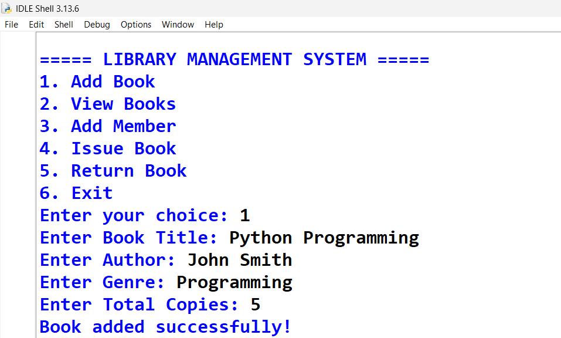

### View Books

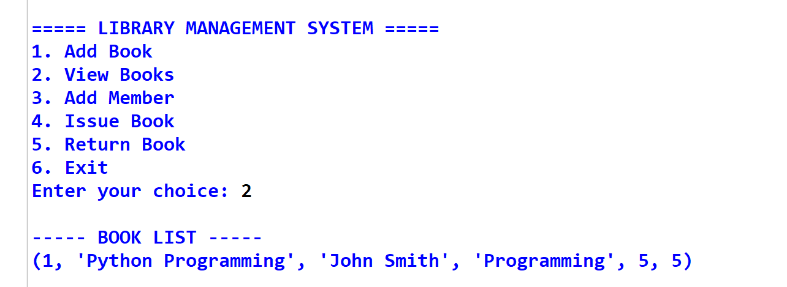

### Add Member

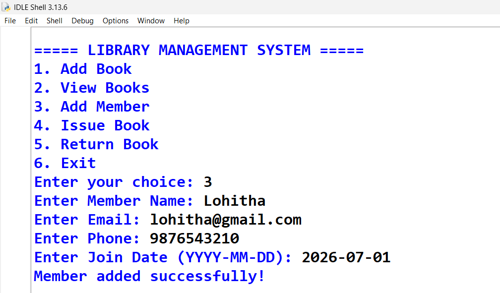

### Issue Book

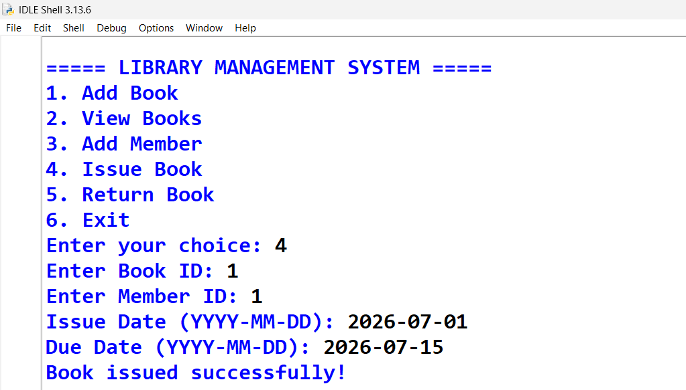

### Return Book

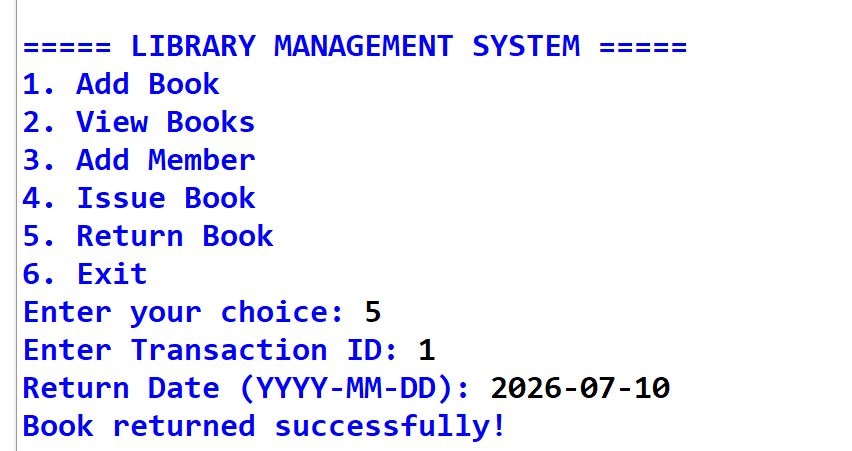

### AI Book Recommendation

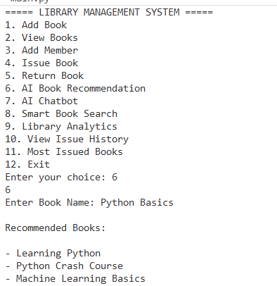

### AI Chatbot

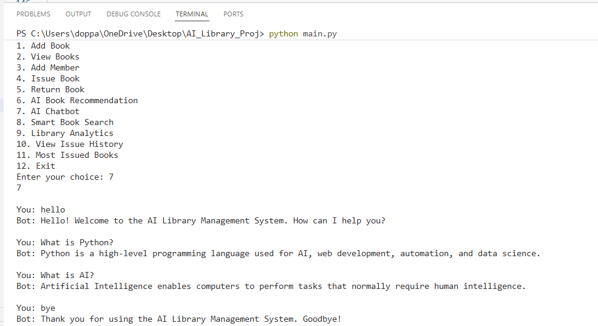

### Smart Book Search

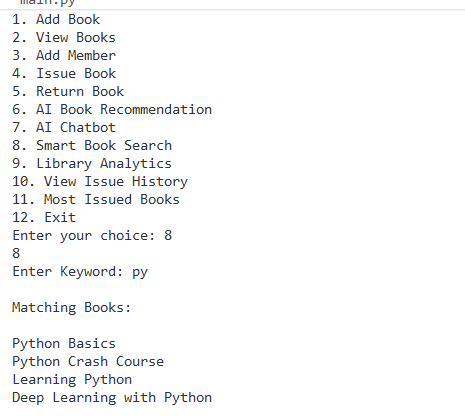

### Library Analytics

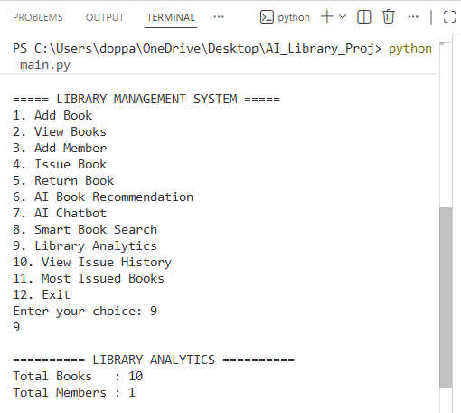

### Issue History

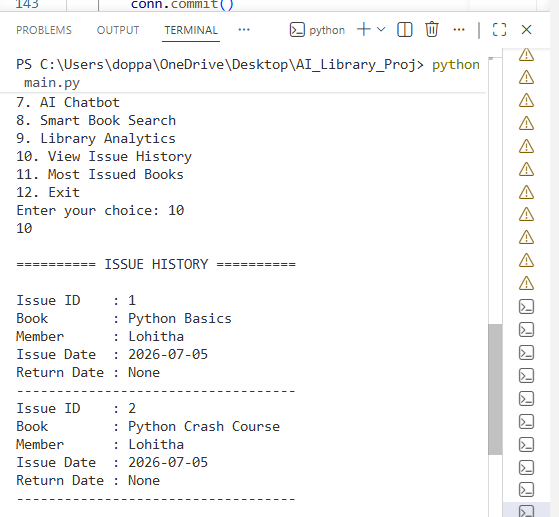

### Most Issued Books

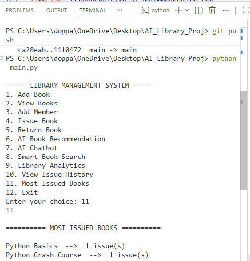

